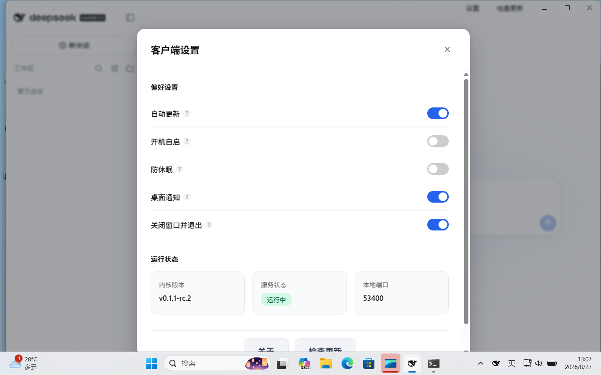
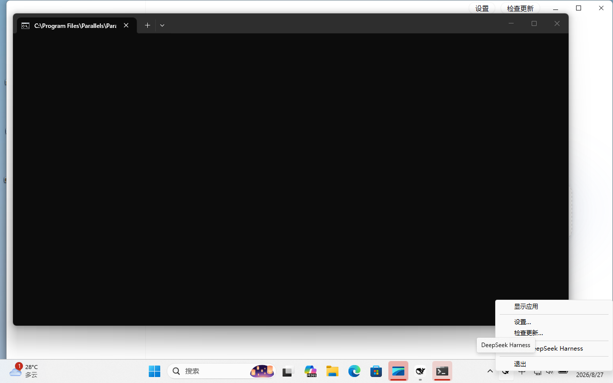

# DeepSeek Harness 桌面客户端

**双击安装，打开即用。** 不用装 Node，不用配镜像源，不用碰终端。

自动从多个镜像里挑最快的下载，支持断点续传。打开即用，关闭后服务继续后台运行。

macOS 与 Windows 双端原生体验，跟随系统深浅色，托盘常驻。

---

## 截图

| 主界面（macOS） | 设置（Windows） | 托盘（Windows） |
|---|---|---|
|  |  |  |

---

## 下载

到 [Releases](https://github.com/InnoTechStudio/deepseek-harness-desktop/releases) 下载最新版本：

| 平台 | 文件 | 要求 |
|---|---|---|
| macOS | `DeepSeek-Harness-x.x.x-aarch64.dmg` | macOS 10.15+，Apple 芯片 |
| Windows | `DeepSeek-Harness-x.x.x-x64-setup.exe` | Windows 10 / 11（64 位） |

---

## 功能

- **开箱即用**　首次打开自动准备运行环境和内核，全程有进度提示
- **自动测速选源**　Node 运行时和内核更新都从多个镜像里挑最快的下载；网络中断可断点续传
- **原生窗口**　界面与标题栏融为一体，macOS 保留交通灯，Windows 保留圆角和 Mica
- **托盘常驻**　关闭窗口后服务继续在后台运行，支持开机自启、防休眠
- **自动更新**　客户端和内核都会自动检查新版本，一键更新，更新后自动重启服务
- **一键反馈**　设置里写下问题点提交，系统信息自动附上（跳转 GitHub Issue）
- **插件市场**　内置 dsh-market，可浏览和安装社区插件
- **本地优先**　所有数据存在本机，不传云端

---

## 使用教程

### 1. 安装

- **macOS**：双击 `.dmg`，拖进 Applications
- **Windows**：双击 `.exe`，按提示安装

首次打开时系统可能提示「无法验证开发者」，在系统设置 → 隐私与安全性里允许即可。

### 2. 首次启动

打开后自动下载运行环境（约 100 MB）和内核（约 30 MB），全程有进度条。完成后直接进入主界面。

### 3. 配置 API

在主界面填入 API 密钥。

**推荐使用 [r8api.com](https://r8api.com/)**：一个 API 中转站，支持 DeepSeek / OpenAI / Anthropic / Google。一个 Key 走天下，不用在各家分别注册充值，也不用为不同模型维护多套配置。

### 4. 日常使用

- **新会话**：左上角「+」或 `Cmd/Ctrl + N`
- **拖拽文件**：把图片/文件拖进窗口即可上传
- **在本地打开**：侧边栏点「在本地打开」，在系统资源管理器里打开当前会话文件夹
- **主题**：跟随系统自动切换，也可在设置里手动指定

### 5. 更新

客户端每 6 小时自动检查更新。发现新版本时标题栏会出现提示，点「检查更新」→「更新」即可。更新完成后自动重启服务。

---

## 常见问题

**Q: 提示「无法验证开发者」怎么办？**
A: macOS 系统设置 → 隐私与安全性 → 仍要打开；Windows 点「更多信息」→「仍要运行」。

**Q: 下载很慢或失败？**
A: 客户端自动从多个镜像里挑最快的下载。检查网络代理设置，或稍后再试。

**Q: 如何卸载？**
A: macOS 直接把 App 拖进废纸篓；Windows 设置 → 应用里卸载。数据目录会保留，重新安装不丢历史记录。

**Q: 数据存在哪里？**
A: macOS：`~/Library/Application Support/com.dshdesk.app/`
Windows：`%APPDATA%\com.dshdesk.app\`

---

## 开发

前置：Rust 工具链 + Node.js 22 + pnpm。

```bash
pnpm install
pnpm tauri dev      # 开发模式
pnpm tauri build    # 打包
```

详细流程见 [docs/build-and-test/](docs/build-and-test/)。

---

## 许可

MIT License © 2026 INNOTECH

## 贡献者

[InnoTechStudio](https://github.com/InnoTechStudio)

---

## 致谢

- [DeepSeek](https://www.deepseek.com/) —— 官方内核与 AI 能力
- [Tauri](https://tauri.app/) —— 跨平台桌面框架
